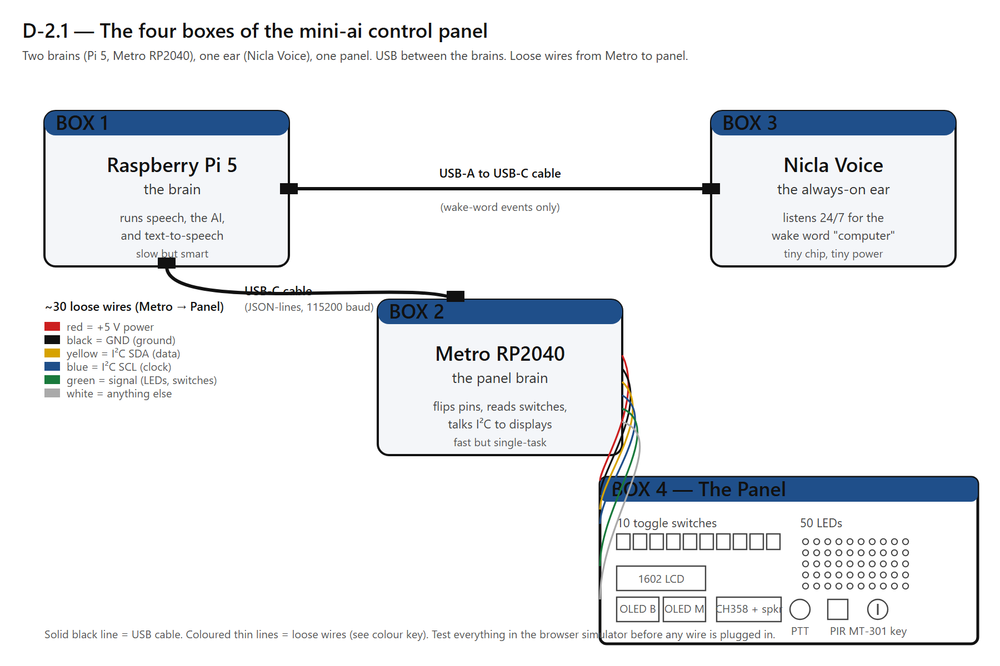
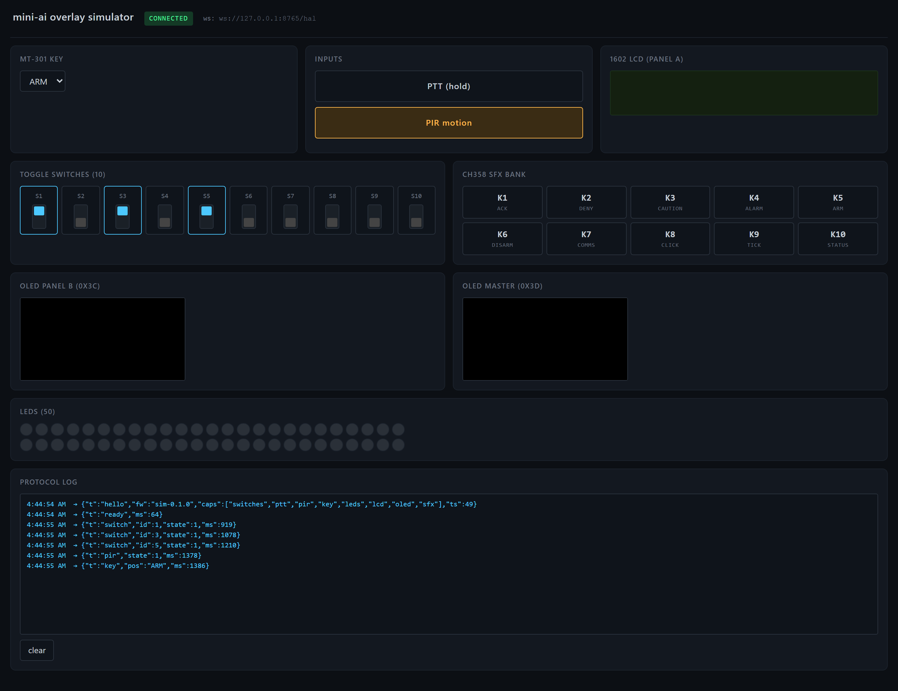

# Chapter 2 — The Big Picture of the Control Panel

## What you're doing in this chapter

Time to zoom out. Before you wire a single part, it helps to have a mental map of what the finished system looks like — what talks to what, and through which cable or wire. In this chapter you'll learn the four "boxes" the system breaks down into, the two kinds of connection between them (USB cables versus loose wires), and one trick that lets you test everything in a web browser before you touch any real hardware.

You'll also draw the picture on paper. The act of drawing it once helps it stick, and you'll come back to that sketch every time the wiring gets complicated.

## Before you start

You should have finished [Chapter 1](01_what_you_already_have.md). You should be able to identify the Pi 5 and its power supply by sight.

You'll need:

- A piece of paper and a pencil.
- About 20 minutes.

You don't need any of the panel parts on the table for this chapter — it's all on paper.

## Step-by-step

### 1. The four boxes

Think of the whole system as four rectangles connected by lines. Each rectangle is a thing that has its own job.

**Box 1 — The Raspberry Pi 5 (the brain).** This is the part you met in Chapter 1. It runs the speech recognition, the language model, and the text-to-speech. When you ask it a question, this is the box that thinks. It's powerful and a little slow — taking a few seconds to think is normal for a real AI conversation.

**Box 2 — The Metro RP2040 (the panel brain).** A second, much smaller board you haven't met yet. The Metro is a **microcontroller**, often shortened to **MCU** (a tiny computer that runs one program forever, talks directly to physical pins, and reacts instantly). The Pi takes seconds to think; the Metro takes microseconds to react. The Pi is good at thinking; the Metro is good at flipping pins. The two of them divide the work cleanly.

**Box 3 — The Arduino Nicla Voice (the always-on ear).** A third board, smaller still — about the size of a postage stamp. The Nicla has a microphone and a tiny chip that's listening 24/7 for a **wake word** (a name the listening device responds to, like a dog's name). It doesn't run the full AI — it only notices the wake word and pokes the Pi. This is how the panel can "wake up" the moment you say "computer."

**Box 4 — The Panel itself.** A flat board with switches, LEDs, displays, a small speaker, and a key switch on the front. Behind the panel, every one of those parts has wires running back to the Metro RP2040.

That's the whole system. **One Pi, one Metro, one Nicla, and a panel.** Everything in chapters 5 through 13 is about wiring the Panel to the Metro, then wiring the Metro to the Pi, then wiring the Nicla to the Pi.

### 2. The connections between the boxes

Now connect the boxes. There are two kinds of connection.

**Kind A — USB cables.** USB is the thick, plug-and-play, "computer-to-computer" cable you already use every day. Three USB cables connect the brains:

a. The **Pi to the Metro** uses one USB-C cable. The Metro looks like a tiny computer to the Pi, and the Pi sends short text messages to it the same way two computers exchange chat messages.

b. The **Pi to the Nicla** uses one USB-A-to-USB-C cable. Same idea. The Nicla sends a "wake word heard!" message to the Pi.

c. The **Pi to its own power supply** uses one USB-C cable to the wall brick.

That's it for USB on the Pi side. Three cables, three plugs.

**Kind B — loose wires.** The Metro talks to the Panel through individual, small wires — not USB. There are roughly 30 of them. You'll wire those one at a time across chapters 5 through 12, on a breadboard first. Each wire has a specific job:

- Some carry **power** to the panel parts.
- Some are **ground wires** (you'll meet ground properly in Chapter 4).
- Some carry **signals** that flip lights on or read whether a switch is up or down.
- Some belong to a **bus** — a shared wire that several devices listen to at the same time. You'll meet the **I²C bus** in Chapter 7.

Don't memorize the wire counts yet. The takeaway: **two brains talk to each other through USB; the Metro talks to the panel through tens of small wires**.

> **DEEP DIVE.** *(optional reading — skip on first pass.)* USB stands for **Universal Serial Bus**. The "serial" part means data is sent one bit at a time down a single pair of wires — but at very high speed. USB also carries 5 V power. That's why the Metro and the Nicla don't need their own power bricks; they sip power from the Pi's USB ports. Loose wires inside the panel work differently: each wire has a single, fixed job, and the voltage on each one is either 0 V or 5 V depending on what the Metro is doing right that moment.

### 3. Why two brains, not one?

A reasonable question: why have the Metro at all? Why not have the Pi talk to all the switches and lights directly?

Two reasons.

a. **The Pi runs an operating system**, like Linux. Operating systems are good at running many programs at once but bad at being on time. If the Pi is busy thinking about an answer, it might miss a switch flick. The Metro, which only has one job, never misses one.

b. **The Pi only has 40 GPIO pins.** The panel has 50 LEDs, 12 switches, 3 displays, and a sound module — together that needs more pins than the Pi has. The Metro adds its own pins and frees the Pi from the wiring entirely.

If you think of the Pi as the chef and the Metro as a waiter, the picture works. The chef cooks (thinks). The waiter takes orders and delivers plates (flips switches and reads inputs). Neither one tries to do the other's job.

> **TIP.** This division is so common that the manual won't keep explaining it. From here on, "the brain" means the Pi, "the panel brain" means the Metro, and "the ear" means the Nicla.

### 4. The simulator trick

Here's the part that makes this build forgiving. Before you wire **anything**, you can run the whole panel inside a **simulator** — a fake panel that opens in your web browser.

A **simulator** is software that pretends to be hardware. The mini-ai project includes one. When you start it, your browser shows pictures of switches, LEDs, displays, and a "play sound" button. You can click the switches in the browser and watch the AI react as if a real switch were being flipped on a real panel. The AI cannot tell the difference between a real switch and the simulated one.

The point of the simulator is that **every later chapter has a way to verify your code is right before any real wiring is done**. You write the firmware, you click the simulated switch, and the AI reacts. Once that works in the browser, you wire the real switch and the same thing happens. If it doesn't, you have ruled out the code already — the problem must be in the wires.

The simulator is also where you'll spend most of [Chapter 5](05_first_test_metro_rp2040.md). You don't have to wait until the panel is built to play with it.

> **TIP.** The simulator runs on your computer, not on the Pi. You open it by going to `http://localhost:8765` in your web browser. The address `localhost` always means "this same computer."

### 5. Draw the picture

Now grab the paper and pencil. You're going to sketch the four-box picture from memory. Don't worry about it being neat.

a. Draw four rectangles. Label them **Pi 5**, **Metro RP2040**, **Nicla Voice**, and **Panel**.

b. Draw a **thick USB line** between the Pi 5 and the Metro RP2040.

c. Draw a **thick USB line** between the Pi 5 and the Nicla Voice.

d. Draw a **bundle of thin wires** between the Metro RP2040 and the Panel.

e. Off to the side, draw a small browser window labelled **Simulator**, and a dotted line from the simulator to the Pi 5 to show that the simulator pretends to be the Metro + Panel when you're testing without hardware.

That's it. You've just drawn the architecture of the whole build. Pin that paper somewhere visible — beside your monitor, on a corkboard, in the parts box — and look at it again whenever a later chapter mentions "the brain" or "the panel brain" and you're not sure which is which.

> **TWO-PERSON.** *(easier with a partner; possible alone.)* If you have someone around who's curious, explain the four boxes out loud to them, pointing at your sketch. Teaching is the fastest way to find the gaps in your own understanding. Going alone? Talk through it out loud to yourself. It feels silly and it works.

### 6. A word about the HAL

You'll keep seeing the abbreviation **HAL** (short for **hardware abstraction layer** — software that hides the difference between real hardware and a simulator). The mini-ai's HAL is what makes the simulator trick work. When you write `play sound 1`, the HAL sends that command either to a real CH358 sound module on the panel or to a simulated speaker in the browser — depending on whether the real one is plugged in. You don't have to change your code to switch between them.

You'll meet the HAL again in Chapter 5 when you run your first command.

## Checkpoint

> **CHECKPOINT.** Close the manual and look at your sketch. You should be able to:
>
> - Name all four boxes.
> - Say which two boxes are "brains" (Pi 5 and Metro RP2040).
> - Say which box is the "ear" (Nicla Voice).
> - Say which two connections are USB and which are loose wires.
> - Explain what the simulator does, in one sentence.
>
> If you can do all five, you're ready for Chapter 3. If not, re-read the relevant step.

## What you just did

You learned the **four-box architecture** of the mini-ai control panel: a Pi (brain), a Metro RP2040 (panel brain), a Nicla Voice (ear), and the panel itself. You learned that USB cables connect the brains and loose wires connect the panel to its brain. You met the **simulator**, which lets you test code without any real wires plugged in — the key trick that makes this whole project forgiving.

You also added five terms to your vocabulary: **microcontroller (MCU)**, **wake word**, **bus**, **simulator**, and **HAL** (hardware abstraction layer).

## Coming up

In [Chapter 3](03_setting_up_your_workspace.md) you'll set up the workspace for real: mount the breadboard, organize the jumper-wire kit, and start the habit of touching grounded metal before opening any chip. Then in [Chapter 4](04_powering_things.md) you'll bring electricity from the Pi to the breadboard — the first wires of the real build.
