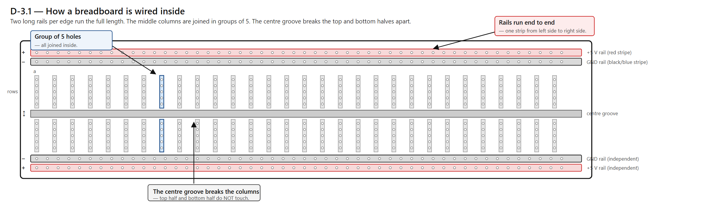

# Chapter 3 — Setting Up Your Workspace

## What you're doing in this chapter

In this chapter you'll set up a clean, organized workspace that you'll use for every wiring chapter that follows. You'll learn what a breadboard is and how its hidden connections run inside it (this matters — many first-time wiring mistakes come from misreading the breadboard layout). You'll lay out the jumper-wire kit so you can grab the right colour without rummaging. You'll cement the "touch metal first" habit you learned in Chapter 0. And you'll set up your phone or camera as a habit-forming progress-photo station.

No electricity flows yet. But by the end of this chapter, the bench is ready for the first wire in Chapter 4.

## Before you start

You should have finished [Chapter 2](02_big_picture_of_the_control_panel.md). The four-box sketch is on the wall.

You'll need:

- The breadboard from your tools tray (one of two).
- The jumper-wire kit.
- The parts box from Chapter 0.
- A phone or camera for progress photos.
- About 25 minutes.

## Step-by-step

### 1. Pick the work surface

You want a flat, dry surface that the build can live on for several weeks. Don't pick:

- The kitchen table (food + electronics = sad chip).
- A carpeted floor (carpets are static generators).
- A bed (bedding is also a static generator, and dropped parts vanish into folds).

You do want:

- A wooden, plastic, or metal desk or table.
- Bright overhead light.
- A power outlet within reach.

> **TIP.** A **cutting mat** — the green or blue self-healing kind that crafters use — is the ideal surface to put under the breadboard. It's matte (your camera won't fight the glare), it's gridded (you can align parts to it), and it doesn't scratch a chip's legs.

### 2. Meet the breadboard

Take a breadboard out of its packaging and put it on the table in front of you. A **breadboard** is a plastic board with hundreds of small holes in it, arranged in rows. Inside the plastic, hidden from view, are thin metal strips that connect some of the holes together. When you push a wire or a chip leg into a hole, that wire is now connected to every other hole that shares the same hidden strip.

Look at the surface. You'll see:

a. A long groove down the middle. This separates the top half from the bottom half.

b. Two long rows on each long edge, marked with a **red** stripe and a **blue** stripe (sometimes blue is black instead — same thing). These are the **rails** (also called the **power rails** or the **+ and − rails**).

c. The main field — many short columns of 5 holes each, on both sides of the centre groove.

The wiring inside the board is the thing you must understand to use it.

Here's the rule:

> **The two long rails on each edge run the full length of the board, side to side. The short columns in the middle are connected up and down, in groups of 5. The centre groove breaks all the column connections — the top half and the bottom half do not touch.**

That's the whole truth about a breadboard. Re-read that sentence and look at the diagram until it clicks. Most beginner wiring mistakes are people forgetting the centre groove breaks the connection, or forgetting that the long rails go the full length.

> **MISTAKE.** *(common error)* The two **+** rails on opposite edges of the board are **not** connected to each other inside the board. The red stripes are only markings — they don't carry current between the top and bottom edges on their own. If you want both edges' + rails to be powered, you'll add a short jumper wire between them. The same is true for the two − rails.

### 3. The colour code for the rails

You'll pick one of the long rails to be **+5 V** (positive power) and the rail right next to it to be **GND** (ground — the shared "zero-volts" reference that every part of the circuit measures against, like sea level for elevations). The red stripe goes with 5 V; the blue or black stripe goes with GND. **Always use the red rail for power and the blue/black rail for GND.** That habit, kept religiously, prevents whole categories of wiring disasters.

You'll meet the full wire-colour convention in [Chapter 4](04_powering_things.md). For now, hold on to one rule: red = power, blue/black = ground.

### 4. Mount the breadboard

Most breadboards have a sticky backing under a paper peel-off. Don't peel it yet. Leave the breadboard loose for the first few chapters in case you need to flip it around. After Chapter 7 or so, when the wiring is set, you can decide whether to stick it down or leave it free.

If you have two breadboards (the bill of materials recommends two), stack them side by side with about a finger's width of gap. You'll need the second one starting in Chapter 9.

### 5. Lay out the jumper-wire kit

Take the jumper-wire kit out of its packaging. A kit usually contains 65 to 200 wires in various lengths and colours.

The wires come in three flavours:

a. **Male-to-male** (a metal pin on each end — push both ends into the breadboard). These are the most common.

b. **Male-to-female** (one end is a pin, the other is a small hole). The pin end goes into the breadboard; the hole end slides over a metal pin on a chip, board, or sensor.

c. **Female-to-female** (holes on both ends). For connecting two chips or boards that both have pins.

For this build you mostly use male-to-male and male-to-female. Female-to-female is rare.

Sort the kit by colour and by length. A common pattern: lay them out in a fan shape on the cutting mat, with each colour in its own row. That way, when Chapter 6 asks for "a red male-to-male wire about 5 cm long," you can grab it in two seconds.

> **TIP.** Don't stretch jumper wires out flat across the breadboard if you can avoid it. Routing them in a clean arc over the board makes wiring easier to read at a glance, easier to photograph for your progress-photo habit, and easier to trace when something breaks.

### 6. Inserting a jumper without bending the leg

Push the metal pin of a jumper into a hole. The hole should grip the pin firmly — you should feel a small click and a tiny amount of resistance. If the pin slides in with no resistance, the hole is worn out (it happens — try a different hole).

The classic first-time mistake is bending the metal pin sideways while pushing. To avoid it:

a. Hold the wire as close to the pin as you can — about 5 mm above the metal.

b. Push the pin straight down into the hole.

c. If it doesn't go in easily, lift, look at the pin, and try again. Don't force it sideways.

A bent pin can usually be straightened with pliers, but the easier fix is to be gentle.

### 7. Re-do the "touch metal first" habit

Before opening any anti-static bag in the chapters ahead, you'll touch a grounded metal object. Pick which metal object you'll use, and put your hand on it now. The case of a computer that's plugged into the wall (whether on or off) is ideal. A radiator works. A metal table leg or a water tap works too.

> **TIP.** A small piece of masking tape on the metal object you've chosen, labelled "ESD ground," is a surprisingly effective reminder. The tape is silly. The habit it builds is not.

> **DEEP DIVE.** *(optional reading — skip on first pass.)* Why does the touch help? Your body is a capacitor — it holds a tiny charge that builds up as you walk around. Touching a grounded metal object lets that charge flow into the building's electrical ground, draining you to zero. Once you're at zero, you can touch a chip without dumping current into it. The drain takes much less than a second. Touching the metal object for two seconds is more than enough.

### 8. Set up the progress-photo station

Put your phone or camera in a stand or propped against a book about 30 cm above the breadboard, pointing down. Open the camera app. Take one photo right now — the empty breadboard on the cutting mat.

That photo, like the one in Chapter 0, is for the habit. Going forward, every wiring chapter ends with "take a progress photo." A series of progress photos turns into your private debugging tool when something stops working.

> **TIP.** Use a phone stand or a small tripod if you have one. The cleanest progress photos come from the camera being in the same position every time, so successive photos can be flipped through quickly to see what changed.

### 9. Organize the parts box

The parts box from Chapter 0 should now hold:

- The Metro RP2040, still in its anti-static bag (don't open it yet — it gets opened in Chapter 5).
- Any chips that have arrived, also still in their bags.
- The bag of 330 Ω resistors and the bag of 4.7 kΩ resistors, if they've arrived. You'll meet these in Chapters 4 and 6.
- Small modules: the CH358 sound module, the LCD, the OLEDs, the MCP23017 expander (if it shipped on a breakout board rather than as a bare chip).

Anything else that's loose. The breadboard and jumper kit live on the work surface, not in the box.

> **TWO-PERSON.** *(easier with a partner; possible alone.)* Some kits arrive with all the resistors and capacitors loose in one bag. Sorting them by value the first time goes much faster with two people — one reads the colour bands, the other writes the value on a little adhesive label or strip of tape. Going alone? A free phone app called "Resistor Color Code" reads the bands from a photo in about 5 seconds.

## Checkpoint

> **CHECKPOINT.** Before continuing to Chapter 4, you should have:
>
> - A clean, well-lit work surface with a breadboard on it.
> - The jumper-wire kit sorted by colour and length.
> - A specific metal object identified as your ESD ground, ideally with a tape label.
> - A camera or phone in a position to take overhead progress photos.
> - A parts box holding everything that isn't currently on the work surface.
> - The ability to point at the breadboard and say which holes are connected to which.
>
> Take a progress photo of the finished workspace now. That's the "before" photo for the rest of the build.

## What you just did

You set up the bench. You met the **breadboard** and learned its internal wiring rule (rails run the full length, columns of 5 are connected vertically, the centre groove breaks things). You met the three kinds of **jumper wires** (male-male, male-female, female-female). You cemented the ESD-grounding habit. And you set up the progress-photo station.

New vocabulary: **breadboard**, **rail**, **jumper wire**, **GND** (ground), and the three flavours of jumper.

## Coming up

In [Chapter 4](04_powering_things.md) you'll bring **electricity** from the Pi to the breadboard for the first time. You'll learn what voltage actually is (a water-pressure analogy that works), why ground has to be shared, and how to wire two female-to-male jumpers from the Pi's GPIO header to the breadboard's red and black rails. You'll also use the multimeter to confirm the wiring is correct.
