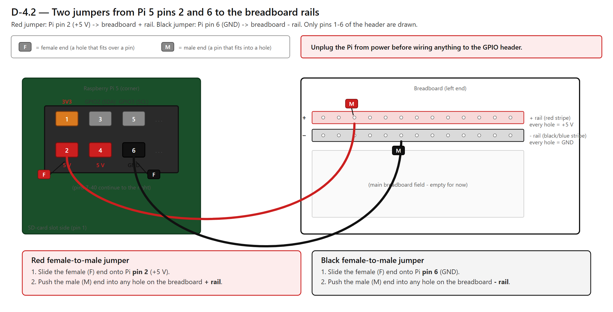
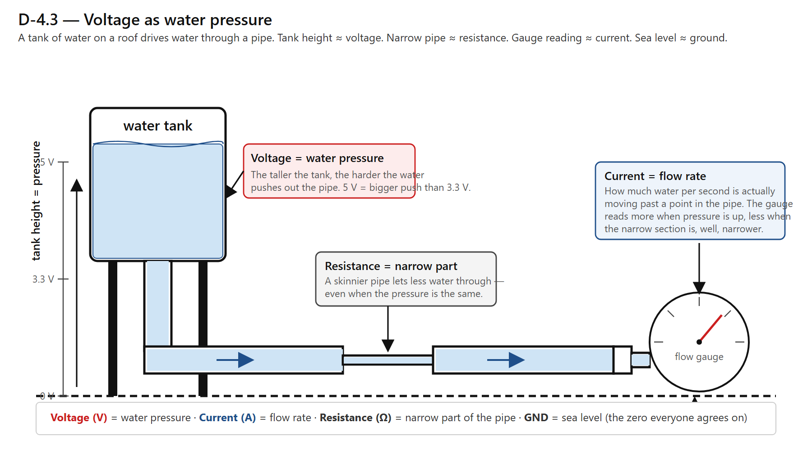
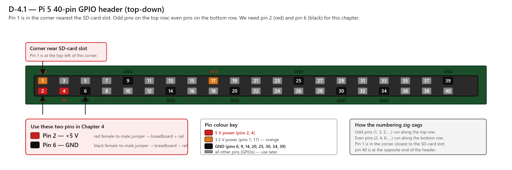

# Chapter 4 — Powering Things

## What you're doing in this chapter

In this chapter, you'll wire the first two real wires of the build: a **+5 V** line and a **GND** line, running from the Raspberry Pi's GPIO header to the breadboard's rails. After this chapter, the breadboard has power on it, ready for chips and modules in the next chapters. You'll also learn what voltage actually means (using a plumbing analogy that works very well), why ground has to be shared between every part of a circuit, and how to use the multimeter to prove the rails are doing what you expect.

This is the first chapter where electricity flows. Take it slowly. There are only two wires to add, and the time you spend understanding them now saves hours of confused debugging later.

## Before you start

You should have finished [Chapter 3](03_setting_up_your_workspace.md). The breadboard is on the cutting mat, the jumper-wire kit is sorted by colour, and the ESD ground is identified.

You'll need:

- The Raspberry Pi 5.
- The 27 W power supply (unplugged for now — you'll plug it in later).
- The breadboard.
- Two **female-to-male jumper wires**: one red, one black, about 15 cm long.
- The multimeter.
- About 30 minutes.

If you don't have a red and black male-to-female jumper, any two colours will do for now — but try to find red and black, because the colour convention you're about to learn matters in every later chapter.

## Step-by-step

### 1. What voltage actually is (the water-pressure picture)

You don't need to understand the physics of electrons. You do need an intuition for what's going on. The plumbing analogy works:

Picture a tank of water on a roof, connected by a pipe to a faucet on the ground.

- **Voltage** is **like water pressure** in that pipe — how hard the water is trying to come out. A higher tank means more pressure. A flat-ground hose at the same elevation has zero pressure.
- **Current** is **like the flow rate** — how much water per second is actually moving through the pipe. Open the faucet wide and the flow rate goes up. Pinch the hose and the flow rate goes down.
- **Resistance** is **like a narrow section of the pipe** that limits how much water can squeeze through, even if the pressure is high.

The water analogy holds for electricity in the parts that matter for this build:

- **5 V** means "five volts of pressure" — about the energy you'd get from a USB cable.
- **3.3 V** means "three-point-three volts of pressure" — lower than 5 V, used by some chips on the panel.
- **0 V** is **GND** — the bottom of the system. Everything that isn't at +5 V or +3.3 V is at GND.

> **DEEP DIVE.** *(optional reading — skip on first pass.)* The unit of voltage is the volt (V), the unit of current is the ampere or amp (A), and the unit of resistance is the ohm (Ω). The relationship between the three is called **Ohm's law**: Voltage = Current × Resistance, or **V = I × R**. You don't need to do math from that formula in this manual — every resistor's value is pre-calculated for you — but it's worth knowing the relationship exists. If pressure goes up and the pipe doesn't get wider, flow goes up. If pressure stays the same and the pipe gets narrower, flow goes down. Same idea.

### 2. Why ground (GND) must be shared

Picture two water tanks. Tank A sits at 5 metres above the ground. Tank B sits at 5 metres above the ground in the next yard over. Each tank has 5 metres of pressure compared to its own yard. But what if Tank B's yard is up a hill, so it's 10 metres higher than Tank A's yard?

From Tank A's point of view, Tank B's water is at 15 metres of pressure. From Tank B's point of view, Tank A's water is at minus 5 metres — it's *lower* than Tank B's ground.

If you try to connect Tank A and Tank B without agreeing on which ground is "zero," water flows in the wrong direction and nobody can predict what'll happen.

Electricity is the same. Every device in the build has to agree on what "zero volts" means. The way they agree is by **sharing a common GND wire** — every chip, every LED, every module has its GND pin connected to the same set of wires that all trace back to the same point. **Sharing a ground is not optional.** A device with its own private "ground" is a device that won't work or, worse, fries other chips connected to it.

> **MISTAKE.** *(common error)* Two breadboards side by side, two power supplies, two devices — and only the +5 V is connected between them. The GNDs are not. Symptom: random behaviour, signals that look right on a multimeter but don't trigger anything. **Always wire the GNDs together before wiring the +5 V together.** Make it a ritual.

### 3. The wire-colour convention

From here to the end of the manual, every wire has a function and that function dictates its colour. Buy or pick wires in these colours; if you only have a few colours, prioritize red and black above all others.

| Function | Colour |
|---|---|
| 5 V power | **Red** |
| 3.3 V power | **Orange** |
| GND | **Black** |
| I²C SDA (data) | **Yellow** |
| I²C SCL (clock) | **Blue** |
| Data / signal | **Green** |
| Anything else | **White** |

You don't need to know what SDA, SCL, or "signal" mean yet. You'll meet them in Chapters 7 and 9. The point right now: **red wires carry 5 V, black wires are GND.** Every diagram in the manual follows that rule. Every photo follows that rule. Your bench should follow it too.

### 4. Find the GPIO header on the Pi

Put the Pi 5 in front of you with the **USB-C power input** facing you (the four big USB ports facing away). The 40-pin **GPIO header** is along the long edge on the right side of the board, a black plastic strip with two rows of 20 metal pins each.

The pins are numbered. Pin 1 is the corner closest to the SD-card slot (or NVMe HAT connector, depending on your setup). The pin next to it is pin 2. Then pin 3 is below pin 1, pin 4 is below pin 2, and so on, zig-zagging down the header.

You only need two pins from this whole header for this chapter:

- **Pin 2 is +5 V.**
- **Pin 6 is GND.**

They happen to be very close to each other — both in the corner of the header next to the SD card / power input. That's convenient.

> **TIP.** A printable Pi 5 GPIO cheat sheet exists at [pinout.xyz](https://pinout.xyz). Print it once, fold it, and keep it in the parts box. The manual will refer to specific pin numbers throughout the rest of the build.

### 5. Confirm the Pi is unplugged

Before touching the GPIO header, **unplug the Pi from its power supply.** Pull the USB-C cable out of the Pi end. The Pi should be completely dark — no lights on the board. Wait five seconds.

> **WARNING.** Never plug or unplug a wire from the GPIO header while the Pi is powered. The pins are small, easy to bump, and a slipped wire that briefly touches the wrong pin can damage the Pi. Always power down first.

### 6. Wire the +5 V from Pi pin 2 to the red rail

a. Take the **red female-to-male jumper wire**. The female end (the small hole) goes onto a GPIO pin. The male end (the pin) goes into the breadboard.

b. Slide the female end gently onto **pin 2** of the GPIO header. It should be a snug fit. Don't push hard — if it doesn't go on, check that you have the right pin (count from pin 1 in the corner).

c. Bring the male end over to the breadboard's **red (+) rail** — the long row on the edge of the breadboard marked with a red stripe — and push it into any hole on that rail.

You've just wired Pi pin 2 to the red rail. Every hole along the red rail is now electrically connected to the Pi's +5 V supply — though there's no power flowing yet, because the Pi is still unplugged.

### 7. Wire the GND from Pi pin 6 to the black rail

a. Take the **black female-to-male jumper wire**.

b. Slide the female end onto **pin 6** of the GPIO header.

c. Push the male end into any hole on the **black or blue (−) rail** of the breadboard.

Now the black rail is connected to the Pi's GND, and the red rail is connected to the Pi's +5 V.

> **TIP.** Take a progress photo right now, before applying power. If anything later looks off, a clear "before" photo of the two-wires-only state is the cleanest starting point for figuring out what changed.

### 8. Power the Pi on

a. Plug the Pi's USB-C power cable back into the Pi.

b. Wait about 5 seconds. You should see the red LED on the Pi come on (power), and the green LED start blinking (the Pi is booting).

The Pi doesn't have to finish booting for the rails to have power on them. The +5 V pin of the GPIO header is energized within milliseconds of plugging in.

### 9. Measure the rail with the multimeter

This is the moment to use the multimeter for the first time. The multimeter is the single most useful debugging tool in electronics — when something doesn't work, the first question is "is there voltage where I expect it?" and the multimeter answers it.

a. Set the multimeter dial to **DC voltage** (look for a setting marked **V⎓** or **VDC** — a V with a straight line, not a wavy line). If the meter has multiple DC-volts ranges, pick the one labelled **20 V** or, if it's an auto-ranging meter, just **V⎓**.

b. Put the **black probe** into the **COM** socket on the multimeter, and the **red probe** into the **VΩmA** socket (or whichever one is labelled for voltage — almost always the one next to COM).

c. Touch the **black probe** to any hole on the breadboard's **black (GND) rail**.

d. Touch the **red probe** to any hole on the breadboard's **red (+5 V) rail**.

e. Read the display. It should show something between **4.9 V and 5.2 V**. If it does, congratulations — your rails are live and correctly wired.

> **CHECKPOINT.** Multimeter reading on the rails:
>
> - Black probe on the GND (black) rail.
> - Red probe on the +5 V (red) rail.
> - Reading should be **between 4.9 V and 5.2 V** (typically around 5.0 V).
>
> If you see a negative number (e.g. −5.0 V), your probes are swapped — put the red probe on the red rail. If you see 0 V, one of the two wires isn't seated properly; pull each out and re-seat. If you see anything wildly different (10 V, 3 V, 12 V), unplug the Pi immediately and double-check that you wired pin 2 and pin 6 — not some other pair.

> **MISTAKE.** *(common error)* It's easy to count from the wrong end of the GPIO header. Pin 1 is the corner closest to the SD-card or NVMe slot, never the corner closest to the network port. If your reading is wrong, count again from pin 1.

### 10. Power down once you've verified

Unplug the Pi. The rails go dark. Leave the two wires in place — they'll stay in for the rest of the build.

> **TIP.** From here on, you'll be plugging and unplugging the Pi at the start and end of every wiring session. Get a USB-C cable with a small in-line on-off switch (a few dollars on Amazon) and you can save the ports.

## Checkpoint

> **CHECKPOINT.** Before moving on to Chapter 5, you should have:
>
> - A red wire from Pi GPIO pin 2 to the breadboard's red rail.
> - A black wire from Pi GPIO pin 6 to the breadboard's black/blue rail.
> - A multimeter reading of about **+5 V** between the rails when the Pi is powered.
> - The Pi back in its powered-off state (USB unplugged), with the rails still wired.
> - A progress photo of the wired breadboard.
>
> If the multimeter doesn't read +5 V, fix that before going further. Every chapter from here on assumes the rails work.

## What you just did

You ran the first two wires of the build. The breadboard now has +5 V on its red rail and 0 V (GND) on its black rail — exactly the same voltages a regular USB cable carries. You learned the **water-pressure analogy** for voltage, why **sharing GND** is mandatory, and the **wire-colour convention** that every later chapter follows. You also took your first multimeter reading.

New vocabulary: **voltage**, **current**, **resistance**, **ground (GND)**, **GPIO header**, **common ground**, **multimeter**.

## Coming up

In [Chapter 5](05_first_test_metro_rp2040.md) you'll meet the **Metro RP2040** for real — the panel's brain. You'll flash it with **CircuitPython**, plug it into your computer over USB, and watch it announce itself in a serial terminal with a `hello` and a `ready` message. That moment is the first big win of the whole build — your code, talking back to you.
